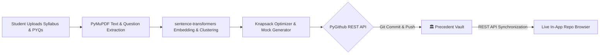

<div align="center">

# 🏛️ Precedent Vault
### *The Decentralized, Open-Access Academic Exam Intelligence Repository*

[](LICENSE)
[](https://github.com/Aditya-dxt/precedent)
[](https://github.com/Aditya-dxt/precedent)
[](https://github.com/Aditya-dxt/precedent)

<p align="center">
  <b>"Your exam has a history. We read it."</b><br>
  Every time a student analyzes a course on <a href="https://github.com/Aditya-dxt/precedent"><b>Precedent</b></a>, the parsed syllabus competencies, semantic question repeat clusters, and simulated mock examination papers are automatically committed here for the benefit of future academic cohorts.
</p>

---

[📖 Overview](#-overview) •
[📂 Vault Hierarchy](#-vault-hierarchy) •
[📊 Topic Prediction Schema](#-topic-prediction-schema) •
[🤖 Automated Ingestion Pipeline](#-automated-ingestion-pipeline) •
[🎓 How Students Use This](#-how-students-use-this) •
[⚖️ Academic Integrity](#-academic-integrity)

---

</div>

## 📖 Overview

**Precedent Vault** is an open-source knowledge repository designed to democratize high-stakes examination preparation. Traditional academic archives leave students with disorganized, un-indexed PDF scans of past papers. Precedent Vault converts unstructured PDFs into **standardized, queryable, and git-versioned academic assets**.

### 🌟 Key Tenets
- **Zero Hallucination Anchor:** Every topic prediction and marks weight is computed directly against verified university syllabi and authentic question papers using `sentence-transformers` semantic clustering.
- **Permanent Open Record:** Publicly browsable via GitHub, accessible via the Precedent web app interface, or clonable for offline study.
- **Collaborative Intelligence:** Every analysis performed by any student anywhere permanently enriches the institutional branch for their junior batches.

---
---

## 📂 Vault Hierarchy

The repository follows a deterministic 3-tier organizational structure: `Institution` $\rightarrow$ `Degree Course` $\rightarrow$ `Subject`:

```ascii
precedent-repository/
└── <institution-slug>/
    └── <course-code-or-slug>/
        └── <subject-slug>/
            ├── syllabus.pdf                      # Official university module syllabus
            ├── pyqs/                             # Multi-year tagged question papers
            │   ├── 2024.pdf
            │   ├── 2023.pdf
            │   ├── 2022.pdf
            │   └── 2021.pdf
            ├── analysis/                         # Extracted semantic intelligence
            │   ├── topic-predictions.md          # Repeat frequency & marks weight matrix
            │   └── topic-clusters.json           # Raw vector cluster mappings & centroids
            └── mock-papers/                      # Pattern-synthesized simulated papers
                ├── mock-paper-01.pdf             # Printable Set A (inferred layout)
                └── mock-paper-02.pdf             # Printable Set B (inferred layout)
```

---

## 📊 Topic Prediction Schema

Inside each subject's `analysis/topic-predictions.md`, Precedent publishes a deterministic breakdown formatted as follows:

| Rank | Syllabus Topic / Competency | Repeat Frequency | Marks Allocation Weight | Historical Occurrences | Prep Budget |
| :---: | :--- | :---: | :---: | :---: | :---: |
| **01** | `Normalization & Normal Forms (1NF to BCNF)` | **90%** | **28%** | 2020, 2021, 2022, 2023, 2024 | 3.0 hrs |
| **02** | `ACID Properties & Transaction Schedules` | **80%** | **22%** | 2021, 2022, 2023, 2024 | 2.5 hrs |
| **03** | `Concurrency Control (Two-Phase Locking & Timestamp)` | **70%** | **18%** | 2020, 2022, 2023, 2024 | 2.0 hrs |
| **04** | `Relational Algebra & Tuple Relational Calculus` | **60%** | **15%** | 2020, 2021, 2023 | 2.0 hrs |
| **05** | `Indexing Techniques (B-Trees & B+ Trees)` | **50%** | **12%** | 2021, 2023, 2024 | 1.5 hrs |

> *Note: Percentages represent statistical recurrence computed through cosine-similarity thresholding on question sentence embeddings.*

---

## 🤖 Automated Ingestion Pipeline

All folders in this repository are managed automatically by the **Precedent Platform Engine**:



1. **Extraction:** PyMuPDF parses raw PDFs into structured question blocks with marks metadata.
2. **Clustering:** `all-MiniLM-L6-v2` clusters semantically rephrased questions across exam cycles.
3. **Synthesis:** Custom Python knapsack solver packages the yield data, while ReportLab renders simulated papers.
4. **Publishing:** The backend commits artifacts with clear commit metadata via GitHub REST API.

---

## 🎓 How Students Use This

### Option A: Via the Web Application (Recommended)
Visit the **Precedent Web Platform** and navigate to the **[Browse Repository](https://precedent.vercel.app/repository)** page to interactively search by university, view visual charts, and download generated papers.

### Option B: Clone Locally for Offline Study
```bash
# Clone the complete academic archive
git clone https://github.com/Aditya-dxt/precedent-vault.git

# Navigate to your college and subject
cd precedent-vault/precedent-repository/<your-university>/<your-course>/<your-subject>/

# Review predicted topics
cat analysis/topic-predictions.md
```

### Option C: Download Specific Mock Papers
Browse directly to the `mock-papers/` directory within your subject folder to download printable, exam-ready question sheets.

---

## ⚖️ Academic Integrity

- Precedent Vault hosts **historical previous-year question papers (PYQs)** and **publicly available course curricula** uploaded by students.
- All mock papers are **algorithmically synthesized simulations** designed for revision diagnostic purposes.
- Content is provided under open-access principles to promote educational equity across universities and institutions.

---

<div align="center">

### Built for **Horizon 2026 Round 1 MVP**
*Theme: AI in Education*

Crafted with care by **[Aditya Dixit](https://github.com/Aditya-dxt)**  
Core Engine & Application: **[Aditya-dxt/precedent](https://github.com/Aditya-dxt/precedent)**

</div>
